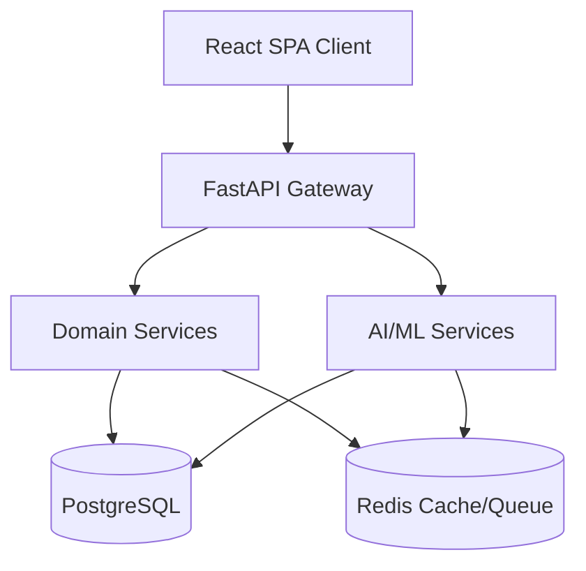

# StockSense

**AI-Augmented Modular Inventory Management System**

StockSense is a modular Inventory Management System (IMS) that digitizes stock operations—receipts, deliveries, internal transfers, and adjustments—replacing manual registers and spreadsheets with a centralized, real-time application. 

Beyond standard inventory features, StockSense integrates an AI/ML layer that adds predictive and conversational capabilities on top of standard transactional inventory tracking.

## 🚀 Key Differentiators

*   **Warehouse Map View:** A spatial floor-plan grid of racks/bins, color-coded by stock level, replacing standard flat tables for physical inventory tracking.
*   **Ledger Timeline:** A vertical, git-log style activity feed of move history, replacing standard row-based logs.
*   **AI Demand Forecasting:** Predictive reorder point suggestions trained on historical ledger data to prevent stockouts.
*   **AI Anomaly Detection:** Automated flagging of unusual stock adjustment patterns to detect potential shrinkage, damage, or process failures.
*   **Natural-Language Query Assistant:** An AI chat panel allowing managers to ask plain-English questions about live inventory state.
*   **Command Palette:** Keyboard-driven navigation (Cmd/Ctrl+K) for lightning-fast jumps to SKUs or quick actions.

## 🏗️ Architecture & Tech Stack



*   **Frontend:** React, TypeScript, Tailwind CSS, shadcn/ui, Recharts
*   **Backend:** FastAPI (Python)
*   **Database:** PostgreSQL
*   **Cache & Queue:** Redis
*   **AI/ML Runtime:** Python (scikit-learn, Prophet, pandas)
*   **LLM Layer:** Claude API (Anthropic)
*   **Infrastructure:** Docker & Docker Compose

## 🛠️ Local Setup Instructions

Prerequisites:
- [Docker & Docker Compose](https://www.docker.com/)

1. Clone the repository.
2. Spin up the infrastructure using Docker Compose:
   ```bash
   docker-compose up -d --build
   ```
3. The API will be available at `http://localhost:8000`.
4. API Documentation (Swagger UI) will be available at `http://localhost:8000/docs`.

## 🗺️ Roadmap

- [x] **Phase 1:** Foundations (Docker, DB schema, Auth)
- [x] **Phase 2:** Product & Warehouse Core
- [x] **Phase 3:** Receipts & Deliveries
- [x] **Phase 4:** Transfers & Adjustments
- [x] **Phase 5:** Dashboard & Differentiated UI
- [x] **Phase 6:** AI/ML Phase 1 (Forecasting)
- [x] **Phase 7:** AI/ML Phase 2 (Anomalies & NL Queries)
- [x] **Phase 8:** Polish & Submission
